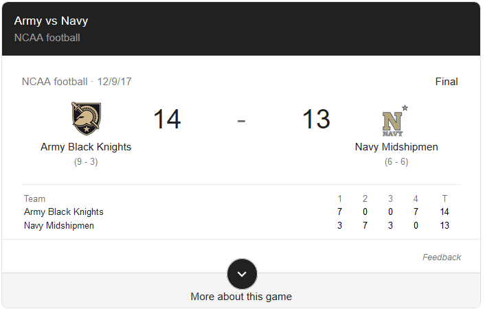

```{r setup, include=FALSE,warning=FALSE,message=FALSE}
knitr::opts_chunk$set(echo = TRUE)
library(tidyverse)
library(lubridate)
require(tidyverse)
require(tidytext)

require(googlesheets)


library(sentimentr)
require(Rcpp)
require(later)
require(packrat) 

```


## What is Data Science
<center>
{width=450px}
</center>
Drew Conway's Venn Diagram of Data Science

## Fundamental Questions{.build}

- What defines success in your business?
- How is this measured?
- What can serve as a proxy?

- Increase Funding -> Engagements from Website -> Clicks on Donate Button

## Fundamental Questions{.build}

- What decisions are you making?
- What data have you collected to support that decision making process?
- Until these questions are answered, data science can do little to help

## AB Testing

- Will changing my website layout impact the number of donations?
- Hypothesis: Placing button in middle will increase number of donations
<center>
{width=450px}
</center>

## Data

```{r}
sample.data<-read.csv("click_data.csv")
sample.data<-sample.data %>% mutate(visit_date=mdy(visit_date))
summarized.data<-sample.data %>% group_by(month(visit_date))%>%
  summarise(avg=mean(clicked_adopt_today))
summarized.data
```

## Randomizing Experiment
```{r}
summarized.data %>% ggplot(aes(x=`month(visit_date)`,y=avg))+
  geom_point()+geom_line()
```

## General Technique{.build}
- Randomly assign visitors to one of `n` web pages
- Collect number of "successes"
- After designated time period determine if meaningful difference exists

```{r}
result<-prop.test(x=c(50,30),n=c(200,200),correct = FALSE)
result$p.value
```

## What do these mean?

- Remember we are tied to a decision here, does new webpage generate more donations/clicks?

- If you decide to switch to new webpage, there is a 1.3\% chance you are wasting your time

- Does not make decision for you, must factor in cost.  If new webpage costs double of old webpage that should be accounted for.

```{r}
result$conf.int
```


## Confidence Interval Analysis

```{r}
result$conf.int
```

- Out of 200 people, we would expect 4-35 more to engage with new webpage

- If each engagement is expected to bring in 1 doller (on average) and new webpage costs an additional 50 dollars a month to maintain, may not be worth it

## Warnings

```{r}
summarized.data %>% ggplot(aes(x=`month(visit_date)`,y=avg))+
  geom_point()+geom_line()
  head(summarized.data)
```
- Let's say trial is done in Month 9
- Does this necessarily mean our results are valid for December?

## What are people saying about you?

- Assumes metric we are interested in is positive tweets that mention WPAOG

- Hypothesis:  If I do X, then people will tweet more positively about WPAOG

```{r,message=FALSE}
added = read_csv("AOGTweets.csv")

textcleaned = added %>%
  unnest_tokens(word, text)

cleanedarticle = anti_join(textcleaned,stop_words, by = "word") %>%
  select(line,word,screenname,time,followerscount,favoritescount, searchterm)

```
- Seperated tweets into individual words

## What are people saying about you?

```{r,echo=FALSE,message=FALSE}
added = read_csv("AOGTweets.csv")

textcleaned = added %>%
  unnest_tokens(word, text)

cleanedarticle = anti_join(textcleaned,stop_words, by = "word") %>% select(line,word,screenname,time,followerscount,favoritescount, searchterm) 

converted = added %>%
      select(-lat,-lng,-coords_coords,-bbox_coords,-geo_coords) %>%
      mutate(text = iconv(text, "UTF-8", "UTF-8",sub=''))
    
senttest = get_sentences(converted$text)
scores_by = sentiment_by(senttest)

workingdata = converted %>%
    mutate(polaritysent = scores_by$ave_sentiment)%>%
   mutate(time = round_date(time, unit = "day")) %>%
   mutate(dayofweek = date(time)) %>%
   mutate(influencescore = favoritescount*polaritysent)


dailysentscore = workingdata %>%
   group_by(dayofweek) %>%
   summarise(AverageDailySentiment = average_downweighted_zero(polaritysent)) %>%
   mutate(AverageDailySentiment = round(AverageDailySentiment,4))

dailysentscore
```


## Most Influential Tweeters

```{r,echo=FALSE,message=FALSE}

InfluencialTweets = workingdata %>%
  top_n(3,influencescore) %>%
  bind_rows(
    workingdata %>%
      top_n(3,influencescore)
  ) %>%
  select(screenname,text,followerscount,favoritescount,polaritysent,influencescore)

library(kableExtra)
kable(InfluencialTweets) %>% kable_styling(font_size = 10) 
```

## Most Negatively Influential Tweeters


```{r,echo=FALSE,message=FALSE}

InfluencialTweets = workingdata %>%
  top_n(-3,influencescore) %>%
  bind_rows(
    workingdata %>%
      top_n(-3,influencescore)
  ) %>%
  select(screenname,text,followerscount,favoritescount,polaritysent,influencescore)

library(kableExtra)
kable(InfluencialTweets) %>% kable_styling(font_size = 10) 
```

## It's all relative...
- Scores are best observed over time
- Influence score is 'man-made'.  Could other things matter?
- Does this support a decision or is it just nice to know?
- What does 'normal' look like?  Is December 12th worse or was there just a single person who tweeted negatively that day?

## Questions need a baseline

```{r,message=FALSE,echo=FALSE}
trends<-read_csv("trends2.csv")
trends <- trends %>% mutate(dayofweek=ymd(Month,truncated = 1))%>%
  mutate(Response=`West Point Army: (United States)`)%>%
  select(Response,dayofweek)
trends %>% ggplot(aes(x=dayofweek,y=Response))+geom_line(lwd=1,color="red")+ggtitle("Google Search History Over Time")
```
## What does normal look like?

```{r}
gah<-decompose(ts(trends$Response,freq=364/12,
                  start=decimal_date(ymd("2004-01-01"))))
plot(gah)
```
- Where are we most abnormal

```{r,echo=FALSE}
trends[which(gah$random==max(na.omit(gah$random))),]
```
<center>
{width=450px}
</center>

```{r}
trends %>% mutate(err=gah$random)%>% filter(err > 30)
```
